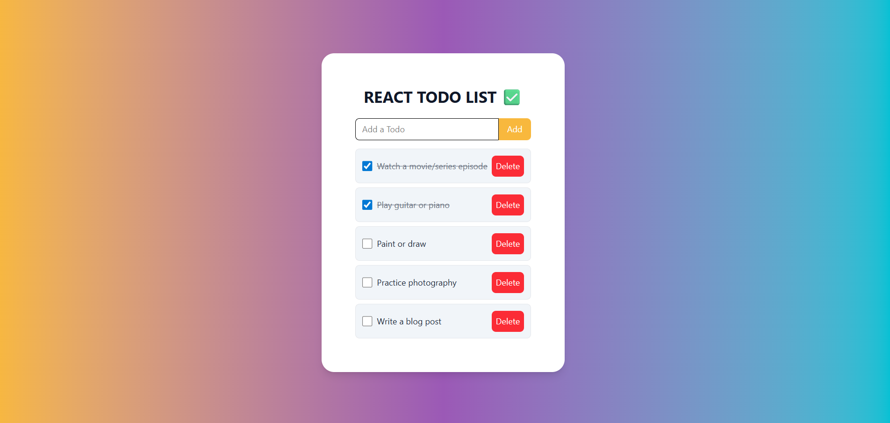

# React To-Do List ✅

A **modern, interactive To-Do List** built with **React** and **Tailwind CSS**, featuring gradient backgrounds, task completion, and deletion. Perfect for showcasing in your portfolio.



---

## Features

- Add tasks with a simple input form
- Mark tasks as **completed** with a checkbox
- Delete tasks individually
- Dynamic UI with **Tailwind CSS**
- Gradient background for a modern look
- Responsive layout

---

## Demo

You can see the live demo here:  
*(Add your deployed link if hosted on Netlify/Vercel/GitHub Pages)*

---

## Installation

1. Clone the repository:

```bash
git clone https://github.com/yourusername/react-todo-list.git
